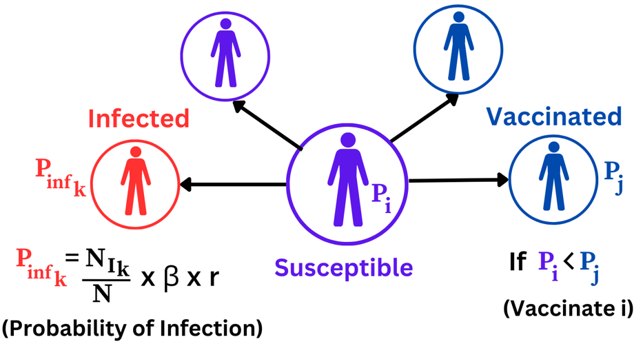
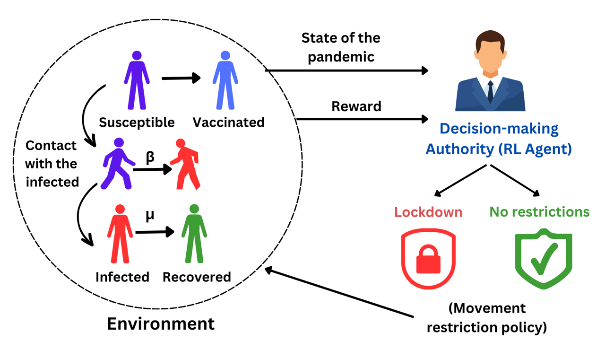

# Reinforcement Learning Approach to Evaluation and Decision-Support of Lockdown Policies for Epidemic Outbreaks 

Reinforcement Learning based decision-making to impose lockdown to prevent an epidemic outbreak.

## Abstract

An epidemic is termed as an infectious disease that is widespread in a population at a specific time. Due to their contagious nature, epidemics have posed a significant hazard to both humankind and therefore the economy. A poor public health infrastructure and high transmission rates are the main contributors for the uncontrollable and rapid spread of these diseases, which make it difficult to manage the outbreak at its source. To prevent such spread and mitigate the risk and the severity of infection, immediate and informed actions by the local authorities are necessary. Through this study, our main objective is to determine how the local authorities can prevent the spread of an epidemic by imposing lockdown in a planned manner. To simulate an epidemic in the real world, we consider a network of individuals with each node representing an individual. Reinforcement Learning is used to model the actions of the local authority in face of an epidemic outbreak with the aim of minimizing the cumulative cost of the epidemic. It is assumed that the local authority has the choice of imposing lockdown or not. Through these models, we aim to discover a common pattern of optimal actions of the local authority that may serve as a key metric to define pre-informed methods of imposing lockdown in a real-world scenario of an epidemic outbreak.  

## Problem Description 

The objective of this study is to explore the potential of reinforcement learning (RL) in designing a decision-making framework for epidemic control, specifically in the case of pandemic outbreaks. The study intends to identify the crucial components of RL that are most effective in making decisions related to epidemic control, including the implementation of lockdowns and provide appropriate actions through calculated risk of socio-economic costs associated with the decisions. These costs are based on factors such as the total population at risk, transmission rates of the disease, probability of vaccination, and the associated long-term risks for individuals who are infected, recovered, vaccinated or have been under isolation due to governmental restrictions. 

## Methodology 

A model based on spatial game theory is used to show the choice of individuals when facing an epidemic, and a deep reinforcement learning (DRL) model is used to find the set of best quarantine policy to mitigate the epidemic.  

### Game Theoretic Environment  

To model the environment of the pandemic, spatial evolutionary game theory is used to show the decision of the individuals to implement preventive measures. Spatial evolutionary game theory uses the payoff of each player to predict the strategy of the player in each step of the game. In this problem, the players are the individuals in the population, and their strategy is whether to vaccinate or not. In spatial evolutionary game theory model players interact with each other and receive a payoff as a result of this interaction. Then each player updates its strategy to maximize their payoff. This strategy selection is usually by copying the strategy of another player in their network of interactions with the highest payoff. In this study, a spatial evolutionary game model based on public goods game is used to simulate the environment [12]. The epidemiological model used in this study is SIRV (Susceptible, Infected, Recovered, Vaccinated) [9]. 



The spatial evolutionary game theory model is extended to use Reinforcement learning using the Open AI Gym environment [10]. The environment class in Open AI gym is built such that it represents the epidemic and a deep RL agent that makes decisions based on the state of the environment and the rewards received from actions taken in that state. The possible states for the environment are S, I, R and V, which represent the susceptible, infected, recovered and vaccinated population respectively and the actions are 0 or 1, which represent imposing no restrictions and imposing restrictions respectively. 

### Deep Reinforcement Learning (DRL) Model  

Deep reinforcement learning is a combination of artificial neural networks with a reinforcement learning framework that helps agent (decision-maker) in the model to learn how to achieve their optimal reward (payoff). Every reinforcement learning model has 4 major components. (1) agent, (2) environment, (3) actions, (4) rewards. In a reinforcement learning model, an agent interacts with the environment and gets reward signals as a result of their actions. The goal is to learn how to take actions to maximize the cumulative reward received from the environment. In the problem of containing epidemics, the problem is to find the best set of actions for the public health policymakers to contain the epidemics with the minimum cost.

$$ Cost = C_{V}  \Delta N_{V} + C_{I}  \Delta N_{I} + C_{R}  \Delta N_{R} + C_{L} L $$

$$ Reward =  \frac{1}{(1 +  e^{ \lambda Cost} } $$



### Environment Requirements for running the model

This guide will provide instructions on how to install and run the necessary requirements for Jupyter in a Python virtual environment. By using a virtual environment, you can isolate your Jupyter installation and its dependencies from your system's Python installation.

**Prerequisites**

Before proceeding with the installation, you should have the following prerequisites:

- Python 3.x installed on your system
- pip package manager installed on your system
- git installed on your system

### Installation

1. Open a terminal or command prompt.

2. Clone the repository by running the following command:

```git clone https://github.com/UNH-Research-Projects/rl_epidemic_control.git```

3. Navigate to the directory where you cloned the repository.

4. Create a new virtual environment by running the following command:

```python -m venv venv```

This will create a new virtual environment named "env" in the current directory.

5. Activate the virtual environment by running the following command:

```source venv/bin/activate```

If you're using Windows, run the following command instead:

```venv\Scripts\activate```

6. Install the necessary requirements by running the following command:

```pip install -r requirements.txt```

7. Start Jupyter by running the following command:

```jupyter notebook```

To run the training and testing, 

    1. Open `run_mlflow_epidemic.ipynb` in Jupyter Notebook.
    2. Run training and testing using the commands given.

## References

[1] J. He and L. Chen, “Optimal control of vaccination dynamics during an influenza epidemic,” Mathematical Biosciences, vol. 231, no. 2, pp. 98-114, 2011. 

[2] Miralles, Luis & Jiménez, Fernando & Ponce, Hiram & Martinez-Villaseñor, Lourdes. (2020). A Deep Q-learning/genetic Algorithms Based Novel Methodology For Optimizing Covid-19 Pandemic Government Actions. 

[3] Khadilkar H, Ganu T, Seetharam DP. Optimising Lockdown Policies for Epidemic Control using Reinforcement Learning: An AI-Driven Control Approach Compatible with Existing Disease and Network Models. Transactions of the Indian National Academy of Engineering. 2020;5(2):129-132. doi:10.1007/s41403-020-00129-3  

[4] Institute of Electrical and Electronics Engineers, “IEEE Reference Guide,” IEEE Periodicals, V 11.12.2018, 2018. [Online]. Available: https://ieee-dataport.org/IEEECitationGuidelines.pdf. [Accessed September 16, 2020].  

[5] N. Yodo, P. Wang, “Resilience Allocation for Early Stage Design of Complex Engineered Systems,” Journal of Mechanical Design, vol. 138, no. 9, pp. 091402 (10 pages), July 2016, doi: 10.1115/1.4033990.  

[6] Z. Tan, R. A. Shirwaiker, “A Review of the State of Art and Emerging Industrial and Systems Engineering Trends in Biomanufacturing,” in Proceedings of 2012 Industrial and Systems Engineering Research Conference, Orlando, FL, USA, May 19-23, 2012, pp. 2407-2414.   

[7] T. Chang, R. Wysk, H. Wang, Computer-Aided Manufacturing, 3rd ed. Upper Saddle River, NJ, USA: Prentice Hall, 2006.   

[8] Soltanolkottabi, Marzieh, David Ben-Arieh, and Chih-Hang Wu. "Modeling Behavioral Response to Vaccination Using Public Goods Game." IEEE Transactions on Computational Social Systems 6.2: 268-276, 2019. 

[9] "Compartmental models in epidemiology," Wikipedia, Dec. 26, 2021. [Online]. Available: https://en.wikipedia.org/wiki/Compartmental_models_in_epidemiology#:~:text=respectively.%5B27%5D-. [Accessed: Feb. 01, 2023]. 

[10] Keras-Gym Documentation. (2021). Keras-Gym Read the Docs. [Online]. Available: https://keras-gym.readthedocs.io/en/stable/.  
 